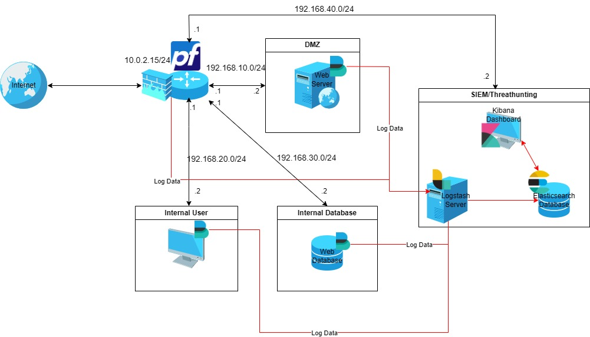

# SIEM/Threat Hunting System - ELK Stack Implementation

-orange)

## Overview

This repository contains the final report for the course *Hệ thống Tìm kiếm, Phát hiện và Ngăn ngừa Xâm nhập* (Intrusion Detection & Prevention Systems), University of Information Technology - VNU-HCM (NT204.Q22.ANTT, Nhom 13).

The project researches and implements a centralized network security monitoring system based on the **ELK Stack** (Elasticsearch, Logstash, Kibana) combined with **Elastic Agent** and **Elastic Defend**, deployed across a simulated enterprise network with segmented DMZ, internal user, database, and SIEM zones behind a pfSense firewall.

## Full Report

The full academic report is kept in [`/docs`](./docs), split by chapter and formatted as Markdown but staying close to the original wording:

| Chapter | Content |
|---|---|
| [1. Tong quan de tai](./docs/01-tong-quan-de-tai.md) | Project introduction, objectives, scope |
| [2. Phan tich he thong](./docs/02-phan-tich-he-thong.md) | System context, problem statement, proposed solution |
| [3. Co so ly thuyet](./docs/03-co-so-ly-thuyet.md) | SIEM/Threat Hunting theory, ELK Stack ecosystem, deployment models |
| [4. Hien thuc hoa de tai](./docs/04-hien-thuc-hoa-de-tai.md) | Architecture, network analysis, per-scenario configuration |
| [5. Trien khai va danh gia ket qua](./docs/05-trien-khai-va-danh-gia-ket-qua.md) | Experiments, data, results evaluation |
| [6. Ket luan](./docs/06-ket-luan.md) | Results achieved, future work |

## Project Objectives

- Build a centralized log collection pipeline using Elastic Agent across endpoints.
- Normalize and enrich log data through Elasticsearch Ingest Pipelines.
- Enable fast, filtered search of security events via Kibana Discover / KQL.
- Design visual monitoring dashboards for system and security event tracking.
- Deploy endpoint monitoring and EDR capabilities with Elastic Defend.
- Explore anomaly detection using Elastic's built-in Machine Learning features.

## System Architecture

**Data flow:** `Elastic Agent/Fleet -> Elasticsearch Ingest Pipeline -> Elasticsearch -> Kibana`

The simulated network is segmented into:

- **DMZ** - public-facing services (Apache/DVWA web server)
- **Internal User network** - end-user workstations
- **Database network** - restricted-access data stores
- **SIEM network** - centralized ELK Stack for log collection and analysis

## Deployment Scenarios

- Centralized log collection (pfSense via Syslog, Apache access/error logs)
- Log normalization to ECS via custom Ingest Pipelines
- Search and filtering with KQL in Kibana Discover
- Detection & response: ICMP blocking, port scanning, SQL Injection, path traversal, EICAR malware detection
- Statistical monitoring dashboards
- Machine Learning-based anomaly detection (event-rate analysis)
- *Bonus:* log ingestion performance benchmarking across multiple nodes
- *Bonus:* custom log format enrichment into full ECS-compliant JSON

Full configuration details for every scenario are in Chapter 4 (coming next).

## Demo Videos

| Scenario | Video |
|---|---|
| Log collection, enrichment, search | [Watch on YouTube](https://youtu.be/Crdebg0otOE) |
| Monitoring dashboard | [Watch on YouTube](https://youtu.be/DxploNANnNQ) |
| Detection & response (EDR) | [Watch on YouTube](https://youtu.be/vQBk5mttAwE) |
| Machine Learning | [Watch on YouTube](https://youtu.be/VoBX3vrbpxc) |
| Extra | [Watch on YouTube](https://youtu.be/3St28_5KjbE) |

> GitHub does not play raw repo-hosted video files inline. Clicking a link above downloads the file or opens it in the browser's own player.

## Results

All experimental scenarios - including ICMP blocking, port scanning, SQL Injection, path traversal, EICAR detection, and ML-based anomaly detection - were successfully implemented and verified on the deployed system. Incident response was also demonstrated through Elastic Defend's host-isolation feature.

## Technologies Used

- Elasticsearch, Logstash, Kibana (ELK Stack)
- Elastic Agent & Fleet
- Elastic Defend (EDR)
- pfSense (firewall)
- Apache HTTP Server, DVWA (test web application)
- Ubuntu, VirtualBox

## My Contribution

Within the 4-member team, I:

- Co-designed the network topology and IP addressing scheme with one teammate
- Solely deployed the entire system (pfSense, Ubuntu hosts, ELK Stack, Fleet-managed Elastic Agent) and packaged it as an OVA image with an installation guide for the rest of the team
- Personally implemented the log collection, log enrichment (ECS normalization via Ingest Pipeline), and search/filtering scenarios
- Personally implemented the two bonus scenarios: log ingestion performance benchmarking and custom log format enrichment

Threat hunting, dashboards, and Machine Learning were implemented by other team members.

## Future Work

- Scale to a multi-node Elasticsearch cluster for higher availability and throughput
- Add more log sources: Windows Event Logs, Active Directory, VPN, IDS/IPS, Docker, Kubernetes, Cloud logs
- Test against more realistic malware in a sandboxed environment
- Extend ML detection with network, process, and user-behavior features
- Explore AI/LLM-assisted log analysis and investigation
- Integrate SOAR (Security Orchestration, Automation and Response) for automated incident response

## Team

Course: NT204.Q22.ANTT - Nhom 13. Instructor: ThS. Đỗ Hoàng Hiển

- Phạm Huy Hoàng - MSSV 23520538
- Nguyễn Minh Quân - MSSV 23521265
- Trương Nguyễn Hoàng Quân - MSSV 23521272
- Ngô Thái Vinh - MSSV 23521791
